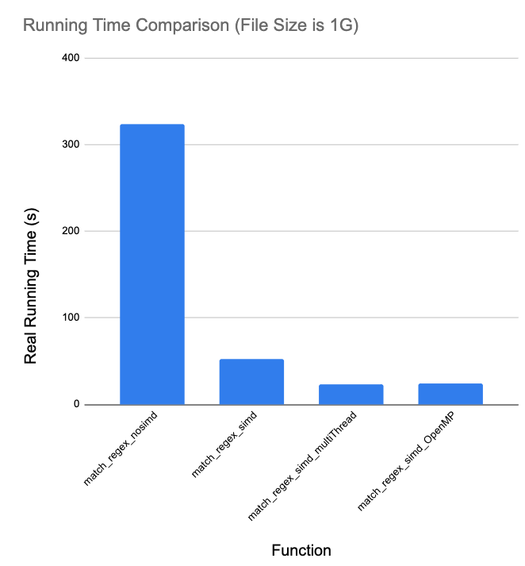

# Demo_Optimization
A small demo to show the progress of optimization in a parser

## Basic Information


### Function

Match lines with offset and assembly code in the file given in the dataset, and then store them.

#### Regex and Example

An example of lines in the file I want to find is:

 ```
        /*0020*/                   S2R R2, SR_TID.X ;											// |   3   : ^ : 
 ```

In this line of string, "0020" is the offset and "S2R R2, SR_TID.X" is the assembly code.

Thus, as you can see, in this file, the string between "**/\***" and "**\*/**" in one line means the offset. And after a offset, there must be a string meaning its corresponding assembly code. The code is ended with " **;**". Additionally, both sides of assembly code may be some space.


The regex used to match is:

```c++
"\\s*/\\*(.*)\\*/( +)(.*);(.*)"
```

In order to make this regex more readable, I split it and explain each part in order based on the example above as following:

```markdown
(1) "\\s*"

- "        "
* It means matching any number of space. It is to match all space before "/*0020*/".
* "\s" is to match space. In C++, it should be written as "\\s".
  
  
(2) "/\\*(.*)\\*/"

- "/*0020*/"
* It is to match offset like "/*0020*/". 
* "/\\*" is to match "/*" ("/" for "/"; "\\*" for "*" ，"\\" is escape character).
* "(.*)" is to match all characters between "/*" and "*/", which is the offset we need. The content could be extracted by regex_match() function in <regex> library.
* "\\*/" is to match "*/"

(3) "( +)(.*); (.*)"

- "                   S2R R2, SR_TID.X ;											// |   3   : ^ : "
* ( +) is to match space after offset. In this file, there must be space between "*/" and code. 
* By the first "(.*)", we could match the assembly code like "S2R R2, SR_TID.X ". The content could also be extracted by regex_match() function in <regex>.
* ";" means the assembly code has ended.
* The last "(.*)" is to match the content after ";". It could be extracted and analyzed to get the status of registers, though we don't do it this time.

  
```


### Environment

A Quad-Core Intel Core i5 CPU @ 1.4GHz with 16GB RAM on macOS Monterey.

### DataSet

Data Set is too large to push to github.

The files could be found in this link:

https://drive.google.com/drive/folders/1bNLpeReT0rvGljnwWtG9r6twVEbZiEgU?usp=sharing


### How To Run

1. Put files in the dataset above into the path ***demo/dataset***.

2. Enter the path ***demo/ExecutableFile***

3. Use command ***time*** to get the running time of each function in each data scale like :

   ```bash
   $ time ./1G_match_noRegex_OpenMP
   ```

   


## Process of Optimization


Originally, it is implemented by **match_regex()** with regex functions.

The running time is about **293 seconds** for 1GB file.

Ways to optimize could be divided by two types: parallel ways and non-parallel ways.

### Parallel Ways

Firstly, I optimized the demo by parallel ways.

**(1)	Multiple Threads**

It is easy to find that the progress of matching each line by regex in the ***for*** loop is so suitable to be implemented by multple threads, because each loop is independent to others.

I implemented **match_regex_multiThread** function by creating threads by myself. I set 4 threads to match the strings. In order to avoid the recourse competition, I created local vector to store the results for each thread and combined them in the end by mutex lock.

In this part, the running time is about **134 seconds** for 1GB file.

**(2)	OpenMP**

Then I think OpenMP may be better than the multi-thread function written by me. So I tried it in **match_regex_OpenMP** function.

In this part, the running time is nearly the same as the multi-thread one.

**(3)	SIMD**

After implementing multi-thread ways in ***for*** loop, I began to consider optimizing regex procedure itself. Considering that it may be hard to matching one string in a multi-thread way, I think SIMD may be suitable for it.

I used an API named rejit based on SIMD to optimize the regex function. This part is implemented in ***include/help_func.hpp***. Using SIMD or not could be determined by ***#define SIMD_MATCH***. 

After testing the program after using SIMD in regex function, the running time is decreased over 80%. (When the input file size is 17M).

Due to the result of this part of experiment,  I utilized SIMD in regex to match strings in multi-thread and OpenMP ways. Then I collect the running time to construct final experiment results.

### Non-parallel Ways

After optimizing the demo by multi-thread ways, I focus on non-multi-thread part.

**(1)	getline() to fgets()**

***getline*** function of C++ took up large part of time, which was found by profiler. After searching, I learned that using ***fgets()*** of C by buffer could be quicker. Then I transformed the reading way to **fgets()** and gained a good improvement. 

Thus, I utilized **fgets()** to all methods too.

**(2)	Replace regex matching**

By analyzing the complexity of regular expression, which is higher than linear ways (match and extract substring by c++ string function), and using CLion profiler to analyze the program, I guess that the performance may be much better after replacing regex ways by string functions. Of course, the standard format of the input file is required.

The result of experiment could also prove this point. In order to make the comparison more meaningful, I change the requirement of the function to: Match offset and its corresponding assembly code in the file, and then store them. 

Unfortunately, I didn't find methods in rejit API which could complete this requirement. So in this part, the SIMD way could not be compared. The visulized result is followed. As we can see, after replacing regex, the running time decreased so much.


However, if the input file is not standard enough, there may be wrong match results. Thus, the performance of methods without regex would not be showed in the final experiment result. 

Though this method is not safe and general enough in many situations, we still could use more determine statements to avoid invalid regex match.


* Explanation of Code

Additionally, next I well explain the main code of this part line by line. In this way, both the function and the limitation of this method could be showed. Then we could know when we can use this method and when we cannot, which is mainly determined by whether the format is strict and what content we need to extract.

I still use the example: 

 ```
        /*0020*/                   S2R R2, SR_TID.X ;											// |   3   : ^ : 
 ```

To simplify the code and focus on the way to deal with string, the OpenMP part and for loop are omitted.

```c++

// Assume that we have got the string from the input file. And the current string variable is str.
// Assuem now str is "        /*0020*/                   S2R R2, SR_TID.X ;											// |   3   : ^ : ".
// The situation that str is an empty string has been excluded. 


// Define string variable of what we want to extract
string offset;
string code;


// (1) Erase all space " " before other characters.
// Then the str is "/*0020*/                   S2R R2, SR_TID.X ;											// |   3   : ^ : "
str.erase(0, str.find_first_not_of(" "));		


// (2) Judge if the head of str is "/*"
// If the conditional statement is true, we could confirm that this str is what we need due to the format of the input file.
if (str.size() >= 0 && str[1] == '*' && str[0] == '/') {
  
  // (3) Match offset and assembly code
  // Then we could gain the content between "/*" and "*/" by their positions in str.
  // offset is "0020", which is the sub string of str.
  auto pos1 = str.find("*/");
  if (pos1 == str.npos) {
    cout << "Format Wrong: No offset." << endl;
    continue;	// Remind: the code we analyze now is in a for loop, which is ommitted
  }
  else {
    offset = str.substr(2, pos1 - 2);
  }

  
  // (4) Erase all text before assembly code
  // First, erase "/*0020*/".
  // Then the str is "                   S2R R2, SR_TID.X ;											// |   3   : ^ : "
  auto pos2 = str.find_first_of(" ");	// There must be space between "*/" and assembly code. 
  if (pos2 == str.npos) {
    cout << "Format Wrong: No space between offset and assembly code." << endl;
    continue;
  } else {
    str.erase(0, pos2);
  }		
  // Second, erase all space before assembly code.
  // Then the str is "S2R R2, SR_TID.X ;											// |   3   : ^ : "
  auto pos3 = str.find_first_not_of(" ");
  if (pos3 == str.npos) {
    cout << "Format Wrong: No assembly code after offset." << endl;
    continue;
  } else {
    str.erase(0, pos3);
  }

  
  // (5) Extract assembly code
  // By finding the position of ";", we could confirm the range of the sub string corresponding to code. Then we could gain the code we need ("S2R R2, SR_TID.X ").
  auto pos4 = str.find_first_of(";");
  if (pos4 == str.npos) {
    cout << "Format Wrong: without ';' after assembly code." << endl;
    continue;
  } else {
    code = str.substr(0, pos4);
  }
  
  
  // Finally, store them
  store_thread[omp_get_thread_num()].push_back(pair<string, string>(offset, code));
}
```


## Visualized Results of Experiment

Finally, after trying such optimization methods, I redesigned the experiment to show the progress of optimization. In order not to make the results too complex, I only maintained the results of main methods to show. (For example, methods using getline() function and multi-thread methods without SIMD are not showed).

Through the visulized results below, we could found that SIMD is very powerful while being utilized in regex match. Multi-thread methods and OpenMP are useful too, especially when the file size is large. It seems that OpenMP is not more powerful than multi-thread methods writen by myself in this situation.





## Summary

### What I did

* Utilized parallel and non-parallel ways to optimize the regex demo.

### What I learnt

* Learnt more ideas to optimize a program.
* Understand some basic knowledge more deeply. For instance, I spent long time debugging multi-thread function written by myself due to something about threads and mutex.
* Found that my former projects could be optimized better. For instance, the problem of competition in my former projects was not solved as well as this demo.

### What I want to do in the future

* There is still something confusing me in SIMD part. I think the function of regex using SIMD could be more powerful (maybe in other API). I haven't studied the source code of API very well.
